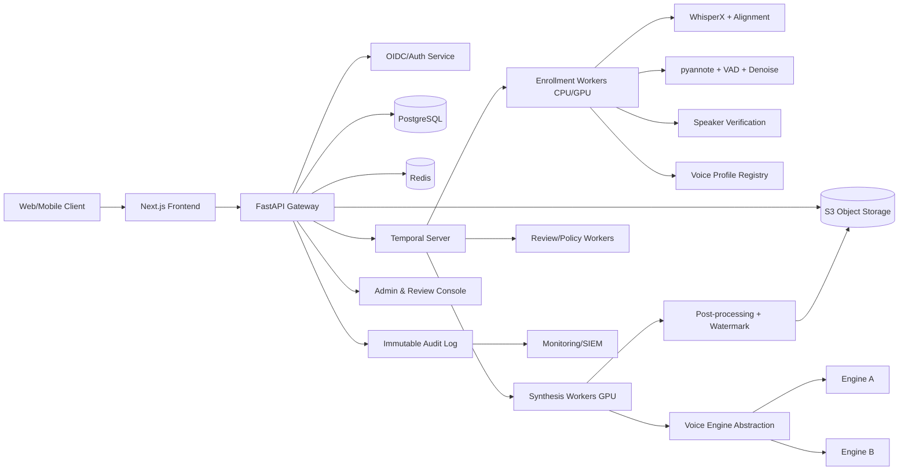
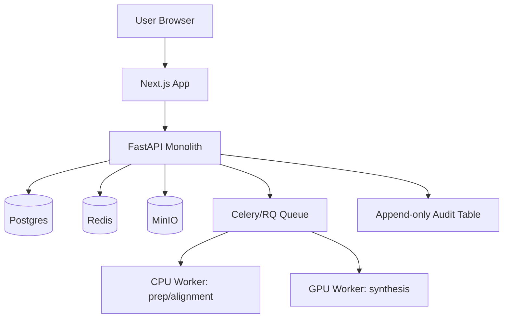

# Personal Voice-Cloning TTS Platform (Self-Voice Only)

Version: 1.0  
Authoring mode: production architecture + MVP architecture  
Scope: self-voice cloning and synthesis only (consented owner voice)

---

## 0) Failure modes first (release-blocking risks)

These are the top failure modes to design against **before** implementation details:

1. **Non-consensual enrollment using stolen audio**
   - Mitigation: active consent capture + liveness phrase + speaker verification against enrollment corpus + risk scoring + manual review triggers.

2. **Replay attack on liveness/consent recording**
   - Mitigation: challenge phrase generated per session, anti-replay checks, device/session binding, timestamp/nonce signing.

3. **Synthetic-to-synthetic re-enrollment**
   - Mitigation: synthetic audio detector in enrollment quality pipeline; higher review threshold when detector confidence is high.

4. **Multiple speakers / wrong speaker in uploaded data**
   - Mitigation: diarization + segment-level speaker verification vs liveness anchor; reject uncertain segments.

5. **Poor transcripts/SRT causing bad adaptation**
   - Mitigation: transcript alignment confidence scoring; fallback to ASR; reject low-confidence pairs.

6. **Long-form drift (skips/repeats, prosody collapse)**
   - Mitigation: chunk planning, overlap and coherence controls, ASR back-check, selective segment regeneration.

7. **Model/legal licensing mismatch for commercial use**
   - Mitigation: legal allowlist of models/checkpoints/licenses; hard-block unapproved engines in production.

8. **Unauthorized synthesis with stolen account token**
   - Mitigation: short-lived auth tokens, risk-based re-auth for high-volume or suspicious jobs, per-user quotas.

9. **Data leakage/model theft**
   - Mitigation: encrypted artifact storage, scoped IAM, signed URLs, no direct model filesystem exposure.

10. **Lack of provenance/disclosure on generated audio**
    - Mitigation: watermark/signature layer + metadata disclosure + immutable generation audit records.

---

## A) Executive summary

Design a two-phase self-voice platform:

1. **Enrollment phase** (audio + optional SRT/transcripts) to build a reusable **voice profile**.
2. **Generation phase** (arbitrary text) to synthesize downloadable speech in enrolled voice.

### Chosen approach by objective

- **Best MVP**: **B) speaker embedding + conditioning**.
- **Best production**: **C) lightweight adaptation/fine-tuning** on top of B.
- **Best commercial-safe**: hybrid architecture with pluggable engines; deploy only legal-approved models, and optionally managed provider where compliance controls are stronger.
- **Best highest-quality**: **D) premium per-user fine-tune** with stricter data-quality and review gates.
- **Best low-latency**: **B)** with cached embeddings and preview-optimized inference.

### Why this is the best fit

- B delivers fastest time-to-value and low operational overhead.
- C improves voice similarity and long-form consistency without full per-user model lifecycle burden.
- D is quality-max but expensive and governance-heavy; reserved for premium/high-data profiles.
- Security stack (consent + liveness + verification + audit + provenance) enforces self-voice-only constraints.

---

## B) Assumptions

1. One account corresponds to one natural person.
2. Only account owner’s own voice (or explicitly consented voice with equivalent proof) may be enrolled.
3. User provides at least one enrollment recording; transcripts/SRT are optional.
4. GPU is available for synthesis (single-GPU MVP, multi-GPU in production).
5. Object storage is S3-compatible.
6. No guarantees are made about model licenses until legal review confirms specific model/checkpoint terms.
7. No feature will be added to hide synthetic origin.
8. All synthesis outputs are tied to an auditable request and policy checks.

---

## C) Decision log

1. **Backend: FastAPI (Python) over Node**
   - Reason: speech ML stack, alignment tools, PyTorch inference, and workflow glue are Python-native.

2. **Workflow orchestration: Temporal**
   - Reason: robust long-running workflows with retries, versioning, and state recovery for enrollment/synthesis jobs.

3. **Queue/cache: Redis**
   - Reason: low-latency task signaling, idempotency keys, quota counters, rate limits.

4. **Database: PostgreSQL**
   - Reason: transactional integrity for consent, audit, job states, policy flags, and relational traceability.

5. **Object storage: S3-compatible (MinIO for MVP)**
   - Reason: large audio/artifact storage, lifecycle rules, signed URL distribution.

6. **Model strategy**
   - MVP = B (embedding-conditioned), production = C (light adaptation), premium = D.

7. **Safety strategy**
   - Mandatory: consent artifact, liveness phrase, speaker verification, immutable audit trail, watermark/disclosure, delete/export.

8. **SRT usage**
   - Enrollment aid only (segmentation/alignment/quality), not required for default generation.

9. **Text pipeline**
   - Deterministic text normalization and pronunciation dictionary first; avoid LLM in critical path unless sandboxed and constrained.

---

## D) Model and tool comparison matrix

> **Important licensing note:** below are engineering suitability assessments. **Commercial legality is blocked until legal verifies exact repository + checkpoint + weight licenses and any usage policies.**

### D1. Voice model candidates

Ratings: High / Medium / Low (relative engineering estimate for architecture decisions).

| Candidate | Voice Similarity | Naturalness | Zero-shot | Adaptation/Fine-tune | Multilingual | Streaming suitability | Long-form stability | SRT/alignment friendliness | Latency | Inference cost | Data need | Ops complexity | Ecosystem maturity | Deployment complexity | Commercial/license risk | Known weaknesses |
|---|---|---|---|---|---|---|---|---|---|---|---|---|---|---|---|---|
| **XTTS** | Medium-High | Medium-High | High | Medium | High | Medium | Medium | High | Medium | Medium | Low-Medium | Medium | High | Medium | **Verify license/checkpoint** | Can drift on long passages; quality sensitive to reference cleanliness |
| **OpenVoice** | Medium-High | Medium | High | Medium | Medium-High | High | Medium | High | High | Low-Medium | Low | Medium | Medium-High | Low-Medium | **Verify license/checkpoint** | Timbre transfer strong but prosody/naturalness can vary |
| **F5-TTS** | High (promising) | High (promising) | Medium-High | High (promising) | Medium-High | Medium | Medium-High | Medium | Medium | Medium-High | Medium | High | Medium | Medium-High | **Verify code+weights terms** | Rapidly evolving; operational reproducibility risk |
| **Fish Speech / Fish Audio** | High | High | High | High | High | Medium | High | Medium | Medium | Medium-High | Medium | Medium | Medium | Medium | **Different OSS vs service terms; verify** | Split between OSS and managed options; consistency depends on stack chosen |
| **CosyVoice** | Medium-High | High | Medium-High | Medium-High | High | Medium | High | Medium | Medium | Medium | Medium | Medium | Medium | Medium | **Verify model/checkpoint terms** | Tooling/inference stack maturity may vary by fork |
| **YourTTS/legacy VITS family** | Medium | Medium | Medium | Medium | Medium | Low-Medium | Medium | Medium | Medium | Low-Medium | Medium | Low-Medium | High | Medium | **Check specific model license** | Older quality ceiling vs latest models |

### D2. Alignment/prep tool candidates

| Tool | Best use | Strengths | Weaknesses | Role in this system |
|---|---|---|---|---|
| **WhisperX** | ASR + forced alignment timing recovery | Strong alignment workflow; good fallback when SRT missing | Accuracy drops with severe noise/multi-speaker | Primary fallback alignment and transcript timing recovery |
| **pyannote.audio** | Diarization/speaker segmentation | Strong speaker turn detection | Requires careful tuning and compute | Multi-speaker detection and speaker isolation |
| **Silero VAD / WebRTC VAD** | Voice activity detection | Fast, robust baseline | Can clip weak speech if thresholds aggressive | Segment boundaries and silence gating |
| **RNNoise / Demucs-like denoise/separation** | Noise/music suppression | Improves downstream alignment and similarity | Over-processing can degrade timbre | Conditional denoise only when quality score requires |
| **Speaker embedding model (ECAPA/x-vector family)** | Speaker verification | Good for similarity gates | Domain mismatch on noisy audio | Verify enrollment segments against liveness anchor |

### D3. Mandatory recommendation summary

1. **MVP engine recommendation:** OpenVoice or XTTS behind a pluggable engine interface, with strong data curation.
2. **Production engine recommendation:** F5-TTS/CosyVoice/Fish-family candidate after legal + quality bakeoff, with optional lightweight adaptation.
3. **Commercial-safe recommendation:** legal allowlist only; if strict compliance is required, use managed provider for final render while keeping self-host option for preview/lab.
4. **Highest-quality recommendation:** premium per-user fine-tuning job (D), only for profiles with sufficient clean data and explicit policy approval.
5. **Lowest-latency recommendation:** embedding-conditioned synthesis (B) with cached speaker embedding and short-chunk synthesis path.

---

## E) Recommended production architecture (Mermaid)



### Production component choices

- Frontend: Next.js + TypeScript.
- API: FastAPI + Pydantic + Uvicorn/Gunicorn.
- Auth: Keycloak (OIDC/OAuth2, WebAuthn/passkeys).
- Orchestration: Temporal (workflow versions for enrollment/synthesis).
- DB: PostgreSQL 16+.
- Cache/queue assist: Redis.
- Object store: S3-compatible with lifecycle and retention policies.
- Inference: Python GPU workers (Torch), separate pools for preview/final render.
- Observability: OpenTelemetry, Prometheus, Grafana, Loki/ELK.
- Admin console: role-separated console for abuse review and policy operations.

---

## F) MVP architecture (Mermaid)



### MVP constraints

- Single GPU, single region, one worker per GPU.
- No Kubernetes required initially (Docker Compose acceptable).
- Keep engine abstraction from day 1 to avoid lock-in.

---

## G) Detailed enrollment data flow

1. **Signup/auth**
   - User signs in via OIDC.
   - Risk checks (IP/device velocity, failed attempts).

2. **Consent capture**
   - Explicit terms: “I confirm this is my voice or I have explicit rights.”
   - Capture consent artifact (text version, timestamp, locale, IP hash, user agent hash).

3. **Active liveness phrase recording**
   - System generates random phrase with nonce.
   - User records in session; store raw + processed version and challenge metadata.

4. **Upload audio**
   - Accept batch uploads; compute checksums; object store ingest.

5. **Upload SRT/transcript (optional, preferred)**
   - Pair by filename/session mapping; support partial coverage.

6. **File validation**
   - MIME/container checks, duration limits, decode sanity, anti-malware scanning.

7. **Audio preprocessing**
   - Resample, channel normalize, loudness normalization, clipping detection.

8. **Speaker isolation / diarization (if needed)**
   - Detect multi-speaker files; keep segments matching target speaker.

9. **Transcript parsing and validation**
   - Parse SRT, normalize unicode/punctuation, detect malformed timestamps.

10. **Forced alignment or fallback ASR alignment**
    - If good SRT/transcript: forced alignment.
    - If missing/bad: ASR transcript + alignment.

11. **Segment extraction**
    - Extract clean segments by timing + VAD boundaries.

12. **Quality scoring**
    - Per-segment SNR/prosody/clipping/music overlap/transcript confidence.

13. **Bad segment rejection**
    - Reject segments below thresholds; keep reasons.

14. **Dataset curation**
    - Build curated set with metadata and train/val split.

15. **Speaker verification (critical gate)**
    - Compare liveness anchor embedding vs enrollment segments.
    - Reject profile if insufficient matched duration above threshold.

16. **Create voice profile / embedding / adaptation**
    - MVP: speaker embedding profile.
    - Production: optional adaptation job if data quality/volume permits.

17. **Storage and versioning**
    - Persist voice_profile version, model engine version, embeddings, quality report.

18. **Readiness checks before generation**
    - Require all policy gates passed and profile status = READY.

### Enrollment input handling logic (explicit)

- **Audio only:** run ASR + alignment fallback, lower confidence, stricter readiness threshold.
- **Audio + transcript:** forced alignment from transcript; ASR used for mismatch detection.
- **Audio + SRT:** trust but verify timing via forced alignment; re-time if drift exceeds threshold.
- **Multiple audio + multiple SRT:** pair by hash/name mapping and temporal overlap; unmatched files processed via ASR fallback.
- **Partial transcript coverage:** use covered portions directly; uncovered portions via ASR.
- **Mismatched/low-quality subtitles:** confidence score; if below threshold, downgrade to ASR path.
- **Multiple speakers:** diarize then verify segments vs liveness anchor.
- **Noisy/music-heavy files:** denoise/separate; reject if residual interference too high.
- **Very short data:** allow profile creation with warning + quality cap + no premium adaptation.
- **Large datasets:** shard processing jobs; cap per-job segment count and deduplicate near-identical segments.

---

## H) Detailed generation data flow

1. **User submits arbitrary text**
   - Input can be plain text or timed-SRT request.

2. **Request validation**
   - Verify profile ownership, status READY, quotas/rate limits, policy checks.

3. **Text normalization**
   - Deterministic normalization for numbers/dates/currency/URLs/acronyms.

4. **Pronunciation handling**
   - Per-user lexicon overrides (names/brand terms); fallback G2P.

5. **Chunking/segmentation**
   - Split by punctuation and max chars/phoneme count; preserve semantic boundaries.

6. **Synthesis in enrolled voice**
   - Use voice profile embedding/adaptation artifact and selected engine mode.

7. **Long-form coherence strategy**
   - Shared style seed + cross-chunk prosody controls + optional overlap smoothing.

8. **Post-processing**
   - Loudness target, limiter, silence cleanup, de-click.

9. **Audio packaging**
   - Concatenate segments, optional chapter markers, optional subtitles.

10. **Download delivery**
    - Signed URL with expiry; access tied to account and job id.

11. **Job status and retries**
    - Workflow states: QUEUED/RUNNING/PARTIAL/FAILED/COMPLETED.

12. **Partial regeneration**
    - Re-render selected segments only; preserve unaffected segments.

13. **Optional target-SRT timed rendering**
    - Duration-aware synthesis with per-segment pacing and alignment validation.

---

## I) API specification (concrete contracts)

Base: `/v1` (JSON over HTTPS, OAuth2 bearer)

### 1. Create enrollment session
- `POST /enrollments`
- Request:
```json
{
  "locale": "en-IN",
  "consent_text_version": "2026-04-01",
  "intended_use": "personal_tts"
}
```
- Response:
```json
{
  "enrollment_id": "enr_123",
  "liveness_phrase": "sunrise delta seven blue",
  "upload_limits": {"max_files": 200, "max_total_minutes": 240}
}
```

### 2. Upload audio asset
- `POST /enrollments/{enrollment_id}/audio:presign`
- Request: `{ "filename": "clip01.wav", "content_type": "audio/wav", "size_bytes": 1234567 }`
- Response: `{ "asset_id": "aud_1", "upload_url": "...", "object_key": "..." }`

### 3. Upload SRT/transcript asset
- `POST /enrollments/{enrollment_id}/transcripts:presign`
- Request: `{ "filename": "clip01.srt", "type": "srt" }`
- Response: `{ "asset_id": "txt_1", "upload_url": "..." }`

### 4. Run validation
- `POST /enrollments/{enrollment_id}/validate`
- Request: `{ "audio_asset_ids": ["aud_1"], "transcript_asset_ids": ["txt_1"] }`
- Response: `{ "job_id": "job_val_1", "status": "QUEUED" }`

### 5. Create voice profile
- `POST /enrollments/{enrollment_id}/voice-profiles`
- Request:
```json
{
  "mode": "mvp_embedding",
  "engine_preference": "auto",
  "allow_adaptation": true
}
```
- Response: `{ "voice_profile_id": "vp_123", "job_id": "job_profile_1" }`

### 6. Fetch profile status
- `GET /voice-profiles/{voice_profile_id}`
- Response includes readiness gates and quality summary.

### 7. Submit synthesis job
- `POST /synthesis`
- Request:
```json
{
  "voice_profile_id": "vp_123",
  "text": "Hello from my personal voice model.",
  "mode": "preview",
  "format": "wav",
  "sample_rate_hz": 24000
}
```

### 8. Submit timed synthesis job
- `POST /synthesis:timed`
- Request includes target SRT segments.

### 9. Regenerate one segment
- `POST /synthesis/{job_id}/segments/{segment_id}:regenerate`

### 10. Preview result
- `GET /synthesis/{job_id}/preview`

### 11. Download final audio
- `POST /synthesis/{job_id}/download-url`
- Response: signed URL + expiry.

### 12. List current user voice profiles
- `GET /voice-profiles`

### 13. Delete voice profile
- `DELETE /voice-profiles/{voice_profile_id}`

### 14. Export user data
- `POST /me/data-export`

### 15. Admin review endpoints (RBAC required)
- `GET /admin/review-cases`
- `POST /admin/review-cases/{case_id}:decision`
- `GET /admin/audit-events?user_id=...`

---

## J) Database schema (logical)

Below is a concise relational design. `id` fields are UUID or ULID.

### `users`
- id (pk), email, auth_subject, status, created_at, deleted_at

### `consent_artifacts`
- id, user_id (fk), enrollment_id, consent_text_version, accepted_at, ip_hash, ua_hash, signature_blob_key

### `liveness_checks`
- id, user_id, enrollment_id, challenge_phrase, recording_asset_id, anti_replay_score, result, created_at

### `source_audio_assets`
- id, user_id, enrollment_id, object_key, checksum_sha256, duration_ms, sample_rate, channels, mime_type, ingest_status

### `subtitle_transcript_assets`
- id, user_id, enrollment_id, object_key, kind(enum: srt/txt/json), language, parse_status

### `alignment_results`
- id, enrollment_id, audio_asset_id, transcript_asset_id, method(enum: forced/asr_fallback), confidence, metrics_json, artifact_key

### `curated_segments`
- id, enrollment_id, audio_asset_id, start_ms, end_ms, text, language, quality_score, reject_reason, speaker_match_score, object_key

### `voice_profiles`
- id, user_id, enrollment_id, profile_version, status(enum: pending/ready/rejected/deleted), engine_family, base_model_version, readiness_report_json, created_at

### `speaker_embeddings`
- id, voice_profile_id, embedding_model_version, vector_ref_key, source(enum:liveness/curated), aggregate_method

### `adaptation_jobs`
- id, voice_profile_id, job_status, engine, hyperparams_json, artifact_key, started_at, ended_at, failure_reason

### `synthesis_jobs`
- id, user_id, voice_profile_id, mode(enum: preview/final/timed), status, request_json, qos_tier, retry_count, created_at

### `generated_assets`
- id, synthesis_job_id, format, sample_rate, channels, duration_ms, object_key, watermark_info_json, checksum_sha256

### `segment_generation_records`
- id, synthesis_job_id, segment_index, input_text, normalized_text, status, object_key, latency_ms, regen_of_segment_id

### `model_versions`
- id, engine_family, model_name, model_digest, license_status(enum: pending/approved/blocked), rollout_stage

### `audit_events`
- id, actor_user_id, actor_role, action, target_type, target_id, event_ts, request_id, ip_hash, immutable_chain_hash

### `abuse_review_cases`
- id, user_id, trigger_type, trigger_score, status, assigned_to, decision, notes, created_at, closed_at

### `deletion_requests`
- id, user_id, scope(enum: profile/account), target_id, status, requested_at, completed_at, evidence_key

---

## K) Object storage structure

```text
s3://vclone/
  raw/
    {user_id}/{enrollment_id}/audio/{asset_id}.{ext}
    {user_id}/{enrollment_id}/transcripts/{asset_id}.{ext}
    {user_id}/{enrollment_id}/liveness/{asset_id}.wav
  processed/
    {user_id}/{enrollment_id}/audio_normalized/{asset_id}.wav
    {user_id}/{enrollment_id}/segments/{segment_id}.wav
    {user_id}/{enrollment_id}/alignment/{alignment_id}.json
  profiles/
    {user_id}/{voice_profile_id}/embeddings/{version}.npy
    {user_id}/{voice_profile_id}/adaptation/{job_id}/...
  synthesis/
    {user_id}/{job_id}/segments/{idx}.wav
    {user_id}/{job_id}/final/output.{ext}
    {user_id}/{job_id}/metadata/provenance.json
  exports/
    {user_id}/{export_job_id}/bundle.zip
  audit/
    chain/{yyyy}/{mm}/{dd}/events.ndjson
```

Retention/lifecycle:
- Raw uploads: configurable (default 30–90 days unless user opts to retain).
- Curated segments/profile artifacts: retained while profile active.
- Generated audio: short retention by default (e.g., 30 days) unless pinned by user.
- Deletion request triggers purge workflow with tombstone audit record.

---

## L) Worker/job design

### Queues / workflow types

1. `enrollment.validate`
2. `enrollment.align`
3. `enrollment.curate`
4. `enrollment.verify`
5. `enrollment.profile_create`
6. `synthesis.preview`
7. `synthesis.final`
8. `synthesis.timed`
9. `synthesis.regen_segment`
10. `compliance.audit_export`
11. `privacy.deletion`

### Retry policy

- Transient infra errors: exponential backoff, max 5 attempts.
- Model OOM: retry with lower batch/chunk size once, then fail.
- Deterministic validation failures: no retry; mark REJECTED with reason.

### Idempotency

- API idempotency key on job submission.
- Workflow dedup by (user_id, profile_id, normalized_request_hash).

### GPU scheduling

- Separate preview and final queues.
- Weighted fair scheduling by user tier + quota.
- Hard caps on concurrent GPU jobs per tenant/account.

---

## M) Deployment plan

### Single-GPU deployment (MVP)

- Docker Compose:
  - `frontend`
  - `api`
  - `worker-cpu`
  - `worker-gpu`
  - `postgres`
  - `redis`
  - `minio`
  - `otel-collector`

### Multi-GPU production

- Kubernetes:
  - API deployment (HPA on CPU/RPS)
  - Temporal cluster
  - CPU worker deployment
  - GPU worker deployment with node selectors + device plugins
  - Stateful services: Postgres (managed preferred), Redis, object store endpoint
  - Service mesh / mTLS between services

### Rollout strategy

1. Canary model version to internal testers.
2. Shadow-run quality checks.
3. Gradual traffic shift by percentage.
4. Auto-rollback on quality or error regression.

---

## N) Security, privacy, and abuse-prevention design

## N1. Threat model and controls

| Threat | Control |
|---|---|
| Non-consensual cloning | Consent artifact + liveness challenge + SV match + risk review |
| Stolen audio uploads | Speaker match to liveness anchor; suspicious-source heuristics; review queue |
| Replayed consent clip | Nonce phrase, timestamp validity, replay fingerprint checks |
| Synthetic re-enrollment | Synthetic audio detector + stricter review |
| Public figure abuse | Name/entity detection + elevated review + policy blocklist |
| Account sharing | Device/session anomaly detection; forced re-auth |
| Mass abuse | Rate limits, quotas, anomaly scoring, staged sanctions |
| Storage leaks | At-rest encryption, per-object ACL deny-by-default, signed URLs |
| Model theft | Isolated inference runtime, no direct model artifact download |
| Unauthorized profile use | Ownership checks on every synthesis request |
| Misuse of generated output | Watermark + disclosure metadata + audit trace |
| Policy evasion via prompts | Deterministic parser for text normalization, no unconstrained agent tools |

## N2. Minimum safety controls (implemented as mandatory)

1. Active consent flow.
2. Liveness phrase recording.
3. Speaker verification between liveness and enrollment set.
4. Per-user quotas and rate limiting.
5. Anomaly detection and moderation triggers.
6. Immutable audit trail.
7. Provenance/watermark/disclosure metadata.
8. Secure signed download URLs.
9. Retention + deletion policy.
10. User export/delete workflow.
11. Admin review dashboard.

## N3. Privacy controls

- Data minimization (store only required artifacts).
- Encryption in transit and at rest.
- Scoped access tokens, short TTL.
- RBAC for admin tools.
- Regional data controls where required.

---

## O) Testing and evaluation plan

### O1. Quality gates (measurable)

Set as configurable policy thresholds per language/engine:

1. **Speaker similarity**: embedding cosine similarity above threshold `T_sim` (calibrated on validation set).
2. **Naturalness**: MOS proxy/human rubric mean above `T_nat`.
3. **Intelligibility**: ASR back-check WER below `T_wer`.
4. **Pronunciation accuracy**: named-entity pronunciation pass rate above `T_pron`.
5. **Alignment accuracy**: word timestamp deviation below `T_align` for timed jobs.
6. **Latency target**:
   - Preview p50 first audio chunk < configured `T_first_chunk`.
   - Final render real-time factor <= configured `T_rtf`.
7. **Throughput target**: sustained jobs/minute above `T_tp` under standard load.
8. **GPU memory target**: peak VRAM per worker below `T_vram`.
9. **Cost per generated minute**: below configured budget `T_cost` (derived from GPU-seconds and infra rates).
10. **Failure rate**: synthesis hard-fail rate below `T_fail`.
11. **Retry policy compliance**: no infinite retries; terminal reason always recorded.
12. **Regression threshold**: block release if any core metric regresses beyond `R_block`.

> Example defaults to start calibration (must be tuned on your data):
> - `T_wer <= 0.12` for neutral scripted text
> - `T_fail <= 1.5%` over rolling 24h
> - `T_first_chunk <= 2.5s` (preview)

### O2. Test categories

1. Unit tests
2. Integration tests
3. End-to-end tests
4. Golden-audio tests (fixed seed/reference)
5. Speaker-similarity tests
6. Transcript/SRT alignment tests
7. Subtitle timing tests
8. Long-form drift tests
9. Adversarial safety tests
10. Load tests
11. Rollback tests
12. Offline evaluation pipeline
13. Human review rubric

### O3. Human rubric (release review)

Scored 1–5 per sample:
- Similarity
- Naturalness
- Intelligibility
- Prosody consistency
- Pronunciation correctness
- Artifact/noise perception

Release blocked if weighted average below threshold or safety checks fail.

---

## P) Risks and mitigations

1. **License drift across model updates**
   - Mitigation: model registry with `license_status`; blocked by default until approved.

2. **Quality variance by language/accent**
   - Mitigation: per-language thresholds, language-specific lexicons, staged rollout.

3. **GPU cost spikes**
   - Mitigation: preview/final tiering, quota control, autoscaling, batch windows.

4. **Liveness false rejects**
   - Mitigation: retry window, calibrated thresholds, fallback manual review.

5. **Noisy enrollment causing poor voice profile**
   - Mitigation: strict curation gates and user guidance to re-record better samples.

6. **Long-form coherence failure**
   - Mitigation: segment-level QC + partial regeneration workflow.

---

## Q) 30/60/90-day roadmap

### First 30 days
- Build MVP stack (FastAPI + Next.js + Postgres + Redis + MinIO).
- Implement consent + liveness + upload + validation pipeline.
- Implement baseline embedding-conditioned synthesis.
- Add audit logging and signed downloads.

### Day 31–60
- Add robust alignment pipeline (SRT + fallback ASR).
- Add speaker verification gates and rejection reasons.
- Add segment regeneration and timed synthesis beta.
- Add quality dashboards and offline eval harness.

### Day 61–90
- Add lightweight adaptation jobs for qualified profiles.
- Harden abuse detection and admin review console.
- Add rollout controls/model registry and canary policy.
- Finalize export/delete SLAs and production SRE runbooks.

---

## R) Critical-path pseudocode

### R1. Enrollment workflow

```python
def run_enrollment(enrollment_id, user_id):
    assert has_valid_consent(user_id, enrollment_id)
    liveness = get_liveness_recording(enrollment_id)
    if not pass_liveness_checks(liveness):
        return reject("liveness_failed")

    audio_assets = load_audio_assets(enrollment_id)
    transcript_assets = load_transcript_assets(enrollment_id)

    prepared = []
    for asset in audio_assets:
        wav = preprocess_audio(asset)  # resample, normalize, detect clipping/noise
        diar = diarize_if_needed(wav)
        prepared.extend(extract_candidate_segments(wav, diar))

    aligned_segments = []
    for seg in prepared:
        transcript = match_transcript(seg, transcript_assets)
        if transcript:
            aligned = forced_align(seg, transcript)
            if aligned.confidence < CONF_ALIGN_MIN:
                aligned = asr_fallback_align(seg)
        else:
            aligned = asr_fallback_align(seg)
        aligned_segments.append(aligned)

    curated = []
    anchor_emb = speaker_embed(liveness)
    for seg in aligned_segments:
        q = score_segment_quality(seg)
        s = cosine_similarity(anchor_emb, speaker_embed(seg.audio))
        if q >= QUALITY_MIN and s >= SPEAKER_MIN:
            curated.append(seg)

    if total_duration(curated) < MIN_CURATED_DURATION:
        return reject("insufficient_curated_audio")

    profile = create_voice_profile(user_id, curated)
    if should_run_adaptation(curated):
        run_light_adaptation(profile, curated)

    mark_profile_ready(profile)
    write_audit("voice_profile_ready", user_id, profile.id)
    return profile.id
```

### R2. Synthesis workflow

```python
def run_synthesis(job):
    profile = get_voice_profile(job.voice_profile_id)
    assert profile.user_id == job.user_id
    assert profile.status == "ready"
    enforce_quota_and_rate_limits(job.user_id)

    normalized = normalize_text(job.text, locale=job.locale)
    chunks = chunk_text(normalized, max_len=MAX_CHUNK_LEN)

    outputs = []
    for idx, ch in enumerate(chunks):
        audio = synthesize_chunk(profile, ch, mode=job.mode)
        qc = quick_qc(audio, ch)  # asr back-check + artifact detector
        if not qc.ok:
            audio = regenerate_chunk(profile, ch, strategy="alternate_seed")
        outputs.append(audio)
        save_segment_record(job.id, idx, ch, qc)

    final = stitch_and_master(outputs)
    final = apply_provenance_watermark(final)
    key = store_generated_asset(job.user_id, job.id, final)

    complete_job(job.id, asset_key=key)
    write_audit("synthesis_completed", job.user_id, job.id)
    return key
```

---

## S) Final recommendation and rejected alternatives

## S1. Final recommendation

1. Launch with **B (embedding + conditioning)** as MVP.
2. Add **C (light adaptation)** for production quality tier.
3. Offer **D (full fine-tune)** only as premium path with strict eligibility.
4. Enforce mandatory self-voice controls (consent, liveness, speaker verification, audit, provenance).
5. Keep model backend pluggable and legally gated via model registry.

## S2. Rejected alternatives

1. **A-only zero-shot reference audio system**
   - Rejected as sole strategy: easiest to launch but insufficient consistency/quality for production expectations.

2. **D-only full fine-tune for everyone**
   - Rejected for default: too costly, operationally heavy, and unnecessary for many users with small datasets.

3. **No liveness/consent gates**
   - Rejected: fails self-voice-only safety requirement.

4. **SRT-required generation path**
   - Rejected: conflicts with requirement that generation should require only text by default.

---

## Detailed audio/ML preprocessing policy (implementation checklist)

### Accepted formats
- Input: WAV, FLAC, MP3, M4A, AAC, OGG (decoded to PCM WAV internally).

### Standardization
- Resample to engine-required rate (e.g., 16k for alignment/SV, 24k for synthesis where needed).
- Convert to mono for analysis; retain original for archival.
- Loudness normalization to target LUFS window.

### Quality detection
- Clipping ratio detection.
- Silence ratio and speech ratio.
- Background noise/music probability.

### Segmentation
- VAD boundaries + min/max segment duration policy (e.g., prefer 2–12s segments).

### Denoise strategy
- Conditional denoise only when quality score is below threshold.
- Keep both raw and denoised derivations; choose per-segment best score.

### Diarization + speaker verification
- Required for multi-speaker or uncertain-source files.
- Keep only segments with high speaker-match confidence to liveness anchor.

### Transcript cleanup
- Unicode normalization, punctuation canonicalization, remove malformed tags.
- Expand numerals and symbols for alignment text form.

### Alignment
- Preferred: forced alignment with provided transcript/SRT.
- Fallback: ASR transcript + alignment.
- Store word-level timings and confidence.

### Grapheme/phoneme strategy
- G2P fallback + user lexicon overrides.
- Locale-aware normalization rules.

### Quality scoring and minimum gates
- Combine acoustic quality, alignment confidence, and speaker-match score.
- Reject if any hard-fail gate is violated.

### Artifact storage
- Store embeddings, alignment artifacts, curation report, and profile build manifest.

---

## Edge-case handling matrix

| Edge case | Policy |
|---|---|
| 5–10 sec audio only | Allow temporary preview-only profile; warn user quality limited; block premium adaptation |
| 30–60 sec audio | Allow MVP profile with warning; require higher runtime QC |
| 3–10 min clean audio | Good for standard profile readiness |
| 30+ min audio | Enable adaptation candidate path; perform dedup and diversity sampling |
| Noisy room audio | Conditional denoise; if post-score low, ask re-record |
| Background music | Source separation attempt; reject if residual music remains high |
| Overlapping speakers | Diarize + keep only high-confidence target segments |
| Call-quality audio | Flag narrowband; accept with quality warning |
| Clipped mic audio | Clip detection and reject heavily clipped segments |
| Whispered speech | Keep only if enough normal speech exists; whisper-only profiles blocked |
| Emotional vs neutral speech | Tag style; default synthesis uses neutral cluster |
| Mismatched transcript/audio | Alignment confidence gate; fallback ASR; reject if still low |
| Mixed-language enrollment | Build multilingual profile tags if enough per-language data |
| Generation language differs from enrollment | Allow only engines proven for cross-lingual in validation; otherwise warn/block |
| Names/acronyms/URLs/dates/currency/code | Deterministic TN + lexicon override + segment-level QC |
| Very long text drift | Chunk + coherence controls + ASR back-check + selective regen |
| Repeats/skips/hallucinations | Detect via ASR alignment mismatch and regenerate affected segments |
| Segments too long sound unnatural | Auto-split by punctuation/prosody rules |

---

## Concrete compliance controls and flows

1. **Retention policy**
   - Raw input retention configurable; default short retention.
   - Derived profile artifacts retained only while profile active.

2. **Deletion flow**
   - User submits deletion request.
   - Revoke generation rights immediately.
   - Purge artifacts + tombstone audit entry.

3. **Export flow**
   - Package user-owned assets, transcripts, generated outputs, and audit summary.

4. **Provenance/disclosure**
   - Include machine-readable metadata manifest with each output.
   - Apply watermark/signature when engine/postprocessor supports it.

---

## Implementation sequence (engineering handoff)

1. Build core data model + API skeleton.
2. Implement consent/liveness + audit events.
3. Implement enrollment preprocessing + alignment + curation.
4. Implement voice profile build and readiness gating.
5. Implement synthesis + download + segment regeneration.
6. Add timed SRT render path.
7. Add policy enforcement, admin review, and deletion/export.
8. Add model registry + controlled rollout.

---

### Licensing/commercial blocker policy (explicit)

- Every model/checkpoint must be registered with:
  - source repository
  - exact weight artifact digest
  - declared license
  - legal approval status
- Runtime selection allows only `license_status = approved`.
- If uncertain: block by default and route to approved alternative.

---

This document is designed to be directly executable by engineering teams for implementation of a self-voice-only cloning/TTS platform with safety and compliance controls built in.
